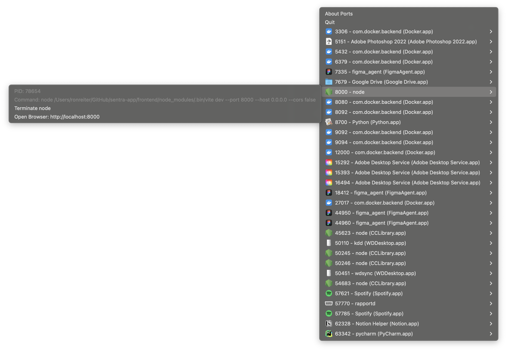

# Ports - Local Port Management Tool



## Introduction
**Ports** is a streamlined Mac application designed to enhance your network management experience. 
Written in Python, this open-source tool provides a real-time overview of all local ports, 
allowing you to quickly identify and manage the applications using them, right from your Mac's menu bar.

Whether you're a developer, network administrator, or just curious about your system's network connections,
Ports offers a user-friendly interface to monitor and control your local ports efficiently.

## Features
- **Real-time Port Monitoring:** Instantly view all open local ports and the applications using them.
- **Application Identification:** Easily find out which application is listening on a specific port.
- **Process Management:** Terminate processes right from the application with a simple click, freeing up your ports.
- **Command Line Visibility:** See the exact command line used by any process running on a port.

## Getting Started

### Installation
To get started with Ports, simply clone the repository and run the application on your Mac:

```bash
make
make build
```

### Usage
After either building the application locally or downloading the latest release, 
simply drag the application to your Applications folder and run it.

Ports is designed to be intuitive and easy to use. The application  displays a list of all open local ports, 
along with the applications using them. 

To terminate a process, simply select it from the list and click the "Terminate" button. 

To view the exact command line used by a process, hover on top of each process and it will appear.